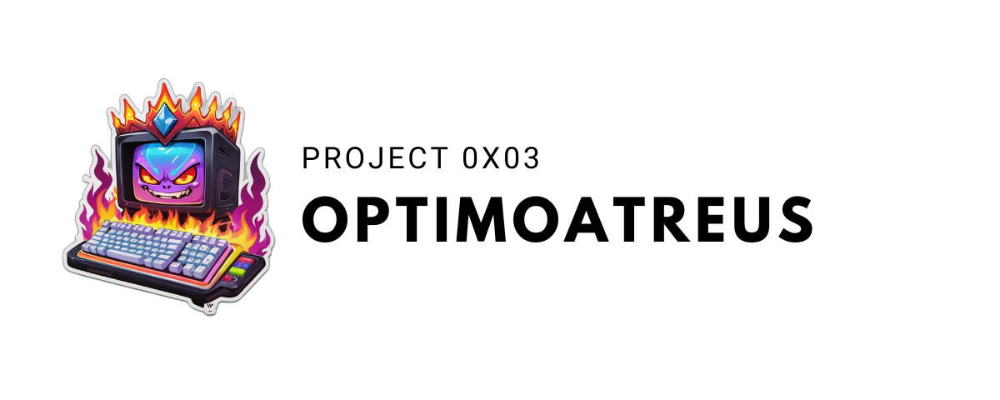

**Description du Projet**

Ce projet est ma configuration pour mon clavier Atreus. J'essie de le mettre a jour le plus regulierement possible.

Le but de cette disposition de clavier et faite pour les personnes qui travaille dans le monde de l'informatique afin d'optimiser la frappe au clavier.

Elle est specialement faire pour les utilisateurs de :

- L'editeur `vim`
- Le Windows manager `i3`

## Table des Matières

1. [Installation](#installation)
2. [Utilisation](#utilisation)
3. [Contribuer](#contribuer)
4. [Licence](#licence)

## Installation

Pour l'installer rien de plus simple, il faut simplement rendre executable le script et le lancer comme ci-dessous :

```bash
git clone https://github.com/TheHackdes/0x03---OptimoAtreus
cd 0x03---OptimoAtreus
chmod +x install.sh
./install.sh
```

## Utilisation

Ce script va simplement copier le fichier `frop` dans `/usr/share/X11/xkb/symbols/` ce qui va vous permettre de modifier votre disposition de clavier avec la commande suivante

```bash
setxkbmap frop
```

## Contribuer

Pour rappel ce projet n'est encore qu'une ebauche, etant toujours en apprentissage de cette disposition toute contribuation et avis / amelioration de cette disposition est la bienvenue.

Pour l'ajout de fonctionnalité il en vas de meme, n'hesiter pas à :

1. Fork du projet
2. Créez une nouvelle branche (`git checkout -b feature/nouvelle-fonctionnalité`)
3. Commit de vos modifications (`git commit -am 'Ajout d'une nouvelle fonctionnalité'`)
4. Push de la branche (`git push origin feature/nouvelle-fonctionnalité`)
5. Créez une pull request

## Licence

Le script est distribué sous la Licence MIT, une licence open source permissive qui permet à quiconque d'utiliser, modifier et distribuer le code, tant que la notice de copyright et la licence sont incluses dans toutes les copies ou parties substantielles du logiciel. Cette licence est réputée pour sa simplicité et sa flexibilité, offrant une grande liberté aux utilisateurs.

